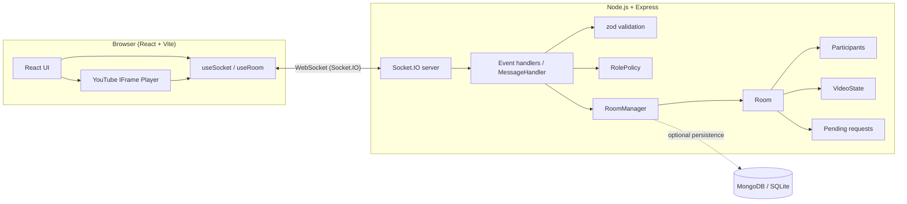

# PROJECT_SPEC.md — YouTube Watch Party System

> Source: "Intern Assignment: YouTube Watch Party System".
> This file says **what** to build and **why**. `TASKS.md` says **in what order**.
> If the two ever disagree, this file wins.

---

## 1. Goal

Build a web app where multiple users watch a YouTube video **together in real time**.
When someone with permission plays, pauses, seeks, or changes the video, **everyone in the room sees the same thing**.
Rooms are created/joined with a code or link. Users have **roles**; the backend enforces what each role may do.
The app must be **deployed publicly** and fully working there.

### MVP success criteria
1. Open the live URL, create a room, share the link/code.
2. A second browser joins and sees the same video at the same position.
3. Host pauses / seeks / changes video → all clients follow within ~1 second.
4. A Participant cannot control playback (UI disabled **and** backend rejects the event).
5. Host promotes a Participant to Moderator; the Moderator can now control playback.
6. Host removes a participant; that user is kicked out.
7. A Participant can *request* a change, and it only takes effect after Host/Moderator approval.
8. README contains the live URL, setup steps, and an architecture overview.

---

## 2. Requirements traceability

| # | Requirement (from PDF) | Priority | Covered in |
|---|------------------------|----------|-----------|
| R1 | Real-time sync of play/pause, seek position, current video | MVP | §7, §8 |
| R2 | Room-based model, unique link/code to create/join | MVP | §8, §11 |
| R3 | YouTube IFrame API playback in sync | MVP | §7, §11 |
| R4 | WebSockets for real-time client↔server communication | MVP | §6, §8 |
| R5 | Role-based access: Host, Moderator, Participant (Viewer optional alias) | MVP | §4 |
| R6 | Host: assign role, remove participant | MVP | §4, §8 |
| R7 | Host: transfer host | Should (optional in PDF, cheap to add) | §4, §8 |
| R8 | Backend validates permissions before processing events | MVP | §4, §10 |
| R9 | Broadcast role updates so UI disables restricted controls | MVP | §8, §11 |
| R10 | Display participant list with roles | MVP | §11 |
| R11 | Playback controls restricted to Host + Moderator | MVP | §4 |
| R12 | Change video via pasted YouTube URL | MVP | §7, §12 |
| R13 | Creator = Host (default admin); host-only actions can't be done by others | MVP | §4 |
| R14 | Joiner = Participant by default | MVP | §4 |
| R15 | Participant must request Host/Mod approval for changes to take effect | MVP (see §5) | §5 |
| R16 | Public deployment (Render / Vercel / Netlify / Railway), live URL in README | MVP | §14 |
| R17 | README.md: setup + run + live URL | MVP | §15 |
| R18 | Architecture overview (how WebSockets fit the flow) | MVP | §6, §15 |
| R19 | Ability to explain libraries, WebSocket sync, role logic, deployment, trade-offs | MVP | §16 |
| R20 | Demo video or screenshots | Optional | §15 |
| B1 | Basic text chat | Bonus | §8 |
| B2 | Emoji reactions | Bonus | §8 |
| B3 | OOP-structured WebSocket server (Room, Participant, MessageHandler…) | Bonus (design it in from the start) | §10 |
| B4 | Persistent rooms in DB | Bonus | §9 |
| B5 | Authentication before joining | Bonus | §9 |
| B6 | Scalability: multi-instance + Redis Pub/Sub adapter, 1000+ users / 100+ rooms / 50+ per room | Bonus | §17 |

---

## 3. Tech stack

The PDF allows any stack as long as WebSockets are used. Chosen stack (matches the "recommended" one and stays inside the MERN-style ecosystem):

| Layer | Choice | Why |
|-------|--------|-----|
| Frontend | **React 18 + TypeScript + Vite** | Recommended stack; fast dev; easy to explain |
| Styling | Tailwind CSS (or plain CSS modules) | Quick, consistent UI |
| Realtime client | **socket.io-client** | Auto-reconnect, acks, rooms; PDF's resources link Socket.IO |
| Backend | **Node.js 20 + Express + TypeScript** | REST for health/room check + hosts the WS server |
| Realtime server | **Socket.IO** | Built-in rooms/namespaces, ack callbacks, Redis adapter path for the scalability bonus |
| Validation | **zod** | Runtime validation of every incoming payload |
| Video | **YouTube IFrame Player API** | Required; load script directly in a `useYouTubePlayer` hook (so you can explain it) |
| Database | **None for MVP (in-memory)**; optional MongoDB (Mongoose) or SQLite for persistent rooms | DB is "optional for MVP" per PDF |
| Testing | Vitest (unit) + socket.io-client (integration) | Prove permission logic |
| Deployment | **Render** (single web service serving API + WS + built client) | Supports long-lived WebSocket connections |

> **Do not host the WebSocket server on Vercel/Netlify** — their serverless functions don't keep persistent WebSocket connections. Use them only for a static frontend, and run the backend on Render/Railway.

Why Socket.IO over raw `ws`: rooms, reconnection, acknowledgements, and an official Redis adapter are built in. Trade-off: extra protocol overhead and clients must also use Socket.IO. Be ready to say this out loud.

---

## 4. Roles & permissions

### Roles
| Role | How obtained | Notes |
|------|--------------|-------|
| **Host** | Auto — room creator | Exactly one per room. Default admin. |
| **Moderator** | Assigned by Host | Playback control only (MVP). |
| **Participant** | Default for joiners | Watch + request + chat. (`Viewer` is treated as an alias of Participant; not implemented separately.) |

### Permission matrix (single source of truth → `server/src/policy/rolePolicy.ts`)

| Action | Host | Moderator | Participant |
|--------|:----:|:---------:|:-----------:|
| `play` / `pause` | ✅ | ✅ | ❌ (can request) |
| `seek` | ✅ | ✅ | ❌ (can request) |
| `change_video` | ✅ | ✅ | ❌ (can request) |
| `action_request` (ask for approval) | — | — | ✅ |
| `resolve_request` (approve/reject) | ✅ | ✅ | ❌ |
| `assign_role` | ✅ | ❌ | ❌ |
| `remove_participant` | ✅ | ❌ | ❌ |
| `transfer_host` | ✅ | ❌ | ❌ |
| `chat_message` / `reaction` | ✅ | ✅ | ✅ |

### Rules
1. Exactly one Host at any moment.
2. Host role changes only via `transfer_host` or automatic succession (§12) — never via `assign_role`.
3. The Host cannot be removed or demoted by anyone else. Host cannot remove themself (they leave or transfer).
4. `assign_role` accepts only `moderator` or `participant` as target roles.
5. Moderators cannot manage roles/participants (PDF says "optionally"; kept off for MVP — flip a flag in `rolePolicy.ts` if desired).
6. **The server derives the actor from the socket** (`socket.id → Participant`). It never trusts a `userId`/`role` sent by the client to identify *who is acting*. `userId` in payloads always refers to the **target**.
7. Every handler: validate payload (zod) → find actor → check permission → mutate room → broadcast. Rejections return `{ ok: false, code: "FORBIDDEN" }` to the sender only.

---

## 5. Approval workflow (Participant → Host/Moderator)

The PDF says: *"Participant must request admin/mod to approve any changes for them to come into action."*
**Interpretation used:** a Participant cannot change playback directly, but can *propose* a change (pause, play, seek, change video). It takes effect only if a Host/Moderator approves.

Flow:
1. Participant sends `action_request { type, payload }` (`type` ∈ `play | pause | seek | change_video`).
2. Server validates the payload, creates a request `{ requestId, fromUserId, type, payload, createdAt }`, stores it in `room.pendingRequests`.
   - Limits: max 3 pending per participant, auto-expire after 60 s.
3. Server emits `request_created` **only to Host + Moderators** (not the whole room).
4. Host/Moderator sends `resolve_request { requestId, approve: boolean }`.
5. Server re-checks the resolver's role. If `approve`, it executes the action exactly as if a privileged user did it, then broadcasts `sync_state`. Either way it emits `request_resolved { requestId, approved }` to the requester (and clears it from mods' queues).
6. If the requester left / was removed, or the request expired, resolving it is a no-op with an error code.

> **Open question:** confirm with the reviewer if "changes" could also mean *role-change requests*. If so, add an optional `request_role` type resolved by the Host. Not required for MVP.

---

## 6. Architecture (how WebSockets fit)



**Key idea:** clients never talk to each other. Every intent goes *client → server*; the **server** validates, updates the room's authoritative state, then **broadcasts** the result to all sockets in that room. Clients only *apply* what the server says.

Example: Moderator presses Pause
1. Client emits `pause`.
2. Server: validate → actor is Moderator → `Room.pause()` updates `VideoState` → `io.to(roomId).emit("sync_state", …)`.
3. Every client (including the sender) receives `sync_state` and calls `player.pauseVideo()` / adjusts position.

---

## 7. Synchronization model (the hardest part — read carefully)

### Authoritative state (server, per room)
```ts
interface VideoState {
  videoId: string;
  playState: "playing" | "paused";
  position: number;   // seconds at the anchor moment
  updatedAt: number;  // server epoch ms of the anchor
  version: number;    // increments on every change
}
// effective position at any time:
// playing → position + (Date.now() - updatedAt) / 1000
// paused  → position
```

### Rules
- **Server is the source of truth.** Clients never assume their local player state is right.
- `play`: anchor `position` (optionally re-anchored by an optional `time` in payload), set `playing`.
- `pause`: compute effective position, freeze it, set `paused`.
- `seek {time}`: set `position = time`, keep current `playState`.
- `change_video {videoId | url}`: server extracts/validates the 11-char ID, resets `position = 0`, state = `playing` (decide once & document; alternative is `paused`).
- Every change bumps `version`; clients ignore a `sync_state` older than what they've applied.

### Client behaviour
- **Late joiner:** receives `room_state` snapshot → loads `videoId` → seeks to effective position → plays if `playing`.
- **Drift correction:** server re-broadcasts `sync_state` every ~5 s while playing. Client only calls `seekTo` if `|localTime − expected| > 1.5 s` (avoids constant jitter).
- **Echo-loop prevention:** when applying a remote state to the player, set an `isApplyingRemote` flag; ignore the `onStateChange` events that this triggers. Only privileged roles emit events from the player at all.
- **Restricted users:** UI controls disabled **and** any local player change is ignored/corrected back to the server state. Backend still rejects direct emits.
- **Seek detection:** the IFrame API has no "seek" event. Avoid the problem: use `controls: 0`, `disablekb: 1`, place a transparent overlay on the iframe, and build a **custom control bar** (play/pause button, seek slider). Then every seek is an explicit UI action you can emit.
- **Autoplay policy:** browsers block autoplay with sound. Require a click on "Join room" (user gesture) before creating the player, and offer an "Unmute" fallback.
- **Player error handling:** `onError` (e.g. 101/150 = embedding disabled, 2 = invalid ID) → show a toast; host can change video.
- **Buffering (state 3):** don't emit; wait for playing/paused.

### YouTube URL parsing (`shared` util, unit-tested)
Accept: `youtube.com/watch?v=ID`, `youtu.be/ID`, `youtube.com/embed/ID`, `youtube.com/shorts/ID`, or a bare ID. ID must match `^[A-Za-z0-9_-]{11}$`. Ignore extra params (`&t=`, `&list=`) for MVP.

---

## 8. WebSocket event contract

Every client→server event uses a Socket.IO **ack callback**: `{ ok: true, data? } | { ok: false, code, message }`.
Error codes: `FORBIDDEN`, `ROOM_NOT_FOUND`, `NOT_IN_ROOM`, `INVALID_PAYLOAD`, `INVALID_VIDEO`, `ROOM_FULL`, `RATE_LIMITED`, `REQUEST_NOT_FOUND`.

### Client → Server
| Event | Payload | Who | Server behaviour |
|-------|---------|-----|------------------|
| `create_room` | `{ username, clientId }` | anyone | Creates room + unique code; caller = Host. Ack `{ roomId, userId, role, state }` |
| `join_room` | `{ roomId, username, clientId }` | anyone | Adds as Participant (or restores previous role if same `clientId` reconnects); joins socket.io room; sends `room_state` to joiner; broadcasts `user_joined` |
| `leave_room` | `{ roomId }` | member | Removes participant; broadcasts `user_left`; triggers host succession if needed |
| `play` | `{ time? }` | Host, Mod | Update state; broadcast `sync_state` |
| `pause` | `{}` | Host, Mod | Update state; broadcast `sync_state` |
| `seek` | `{ time }` | Host, Mod | Validate `time ≥ 0`; update; broadcast |
| `change_video` | `{ videoId }` (or `url`) | Host, Mod | Parse/validate ID; update; broadcast |
| `assign_role` | `{ userId, role }` | Host | Target must exist, not Host; role ∈ moderator/participant; broadcast `role_assigned` |
| `remove_participant` | `{ userId }` | Host | Target not Host; emit `removed` to target, disconnect from room; broadcast `participant_removed` |
| `transfer_host` | `{ userId }` | Host | Old host → Moderator, target → Host; broadcast `host_transferred` |
| `action_request` | `{ type, payload }` | Participant | Create pending request; emit `request_created` to Host+Mods |
| `resolve_request` | `{ requestId, approve }` | Host, Mod | Execute or discard; emit `request_resolved` |
| `chat_message` *(bonus)* | `{ text }` (≤ 300 chars) | member | Rate-limited; broadcast |
| `reaction` *(bonus)* | `{ emoji }` (allow-list) | member | Rate-limited; broadcast |

### Server → Client
| Event | Payload | To |
|-------|---------|----|
| `room_state` | `{ roomId, you: { userId, role }, participants, videoState, pendingRequests? }` | joiner only |
| `sync_state` | `{ playState, currentTime, videoId, version, serverTime }` | room |
| `user_joined` | `{ username, userId, role, participants }` | room |
| `user_left` | `{ username, userId, participants }` | room |
| `role_assigned` | `{ userId, username, role, participants }` | room |
| `participant_removed` | `{ userId, participants }` | room |
| `removed` | `{ reason }` | kicked user |
| `host_transferred` | `{ oldHostId, newHostId, participants }` | room |
| `request_created` | `{ requestId, fromUserId, username, type, payload }` | Host + Mods |
| `request_resolved` | `{ requestId, approved }` | requester (+ mods to clear queue) |
| `chat_message` / `reaction` | `{ userId, username, text/emoji, ts }` | room |

`participants` is always an array of `{ userId, username, role }` so the UI can re-render the list from any event.

---

## 9. Data model

### In-memory (MVP)
```ts
type Role = "host" | "moderator" | "participant";

interface ParticipantData { userId: string; clientId: string; socketId: string; username: string; role: Role; joinedAt: number; connected: boolean; }
interface PendingRequest  { requestId: string; fromUserId: string; type: "play"|"pause"|"seek"|"change_video"; payload: unknown; createdAt: number; }
interface RoomData { roomId: string; hostId: string; participants: Map<string, ParticipantData>; video: VideoState; pending: Map<string, PendingRequest>; createdAt: number; lastActiveAt: number; }
```
- `userId`: server-generated per participant per room. `clientId`: random UUID stored in the browser's `localStorage`, used to restore identity/role after a refresh.
- Room code: 6 chars from `ABCDEFGHJKLMNPQRSTUVWXYZ23456789` (no 0/O/1/I), collision-checked. Link format: `/room/ABC123`.

### Optional persistence (bonus B4)
Collection/table `rooms`: `{ roomId, hostClientId, currentVideoId, lastPosition, createdAt, lastActiveAt }`. On boot, rooms are lazily restored when someone joins a known code.

### Optional auth (bonus B5)
Simple email+password or Google OAuth → JWT sent in the Socket.IO `auth` handshake; `clientId` becomes the user's account ID.

---

## 10. Backend design (OOP)

```
server/src/
  index.ts                 # bootstrap Express + Socket.IO, static client, /health
  config.ts                # env parsing (PORT, CLIENT_ORIGIN, NODE_ENV, MONGODB_URI?)
  rooms/
    Participant.ts         # class Participant { userId, username, role, socketId, … }
    Room.ts                # class Room { participants, video, pending; join/leave/assignRole/removeParticipant/transferHost/play/pause/seek/changeVideo/toSnapshot }
    VideoState.ts          # class VideoState { getEffectivePosition(), play(), pause(), seek(), change() }
    RoomManager.ts         # class RoomManager { createRoom, getRoom, deleteRoom, cleanup timer }
  policy/
    rolePolicy.ts          # class RolePolicy { can(role, action): boolean } + permission map
  handlers/
    MessageHandler.ts      # class MessageHandler { register(socket) → wires events }
    playbackHandlers.ts    # play/pause/seek/change_video
    roomHandlers.ts        # create/join/leave
    roleHandlers.ts        # assign_role/remove/transfer
    requestHandlers.ts     # action_request/resolve_request
    chatHandlers.ts        # (bonus)
  validation/schemas.ts    # zod schemas for every event
  utils/                   # youtubeId.ts, roomCode.ts, rateLimiter.ts, logger.ts
  __tests__/               # rolePolicy, Room, youtubeId, integration
```
Principles: `Room` owns state and business rules (no socket code inside it); `MessageHandler` is the only place that touches sockets; `RolePolicy` is the only place that knows the matrix. This separation is what the OOP bonus asks for and makes unit testing trivial.

---

## 11. Frontend design

Routes: `/` (landing: create room / join by code) and `/room/:roomId` (room). Visiting a room link without a username shows a "Enter your name" gate.

Components: `LandingPage`, `RoomPage`, `VideoPlayer`, `PlaybackControls` (custom bar), `VideoUrlForm`, `ParticipantList` (role badges + host action menu: promote / demote / remove / make host), `RequestQueue` (Host/Mod: approve/reject), `RequestButton` (Participant), `ShareRoom` (copy code/link), `ConnectionStatus`, `Toasts`, `Chat`/`Reactions` (bonus).

Hooks/state: `useSocket` (single socket instance, reconnect handling), `useRoom` (reducer/context holding participants, role, video state, requests), `useYouTubePlayer` (loads IFrame API once, exposes `apply(state)` + emits via callbacks).

UI rules: controls render **disabled** (not hidden) with a tooltip "Only Host/Moderators can control playback" for Participants; role updates take effect instantly on `role_assigned`; show the user's own role prominently.

---

## 12. Edge cases & required behaviour

| Case | Behaviour |
|------|-----------|
| Page refresh | Reconnect with same `clientId` → restore same participant & role (grace 30 s) |
| Host disconnects > 30 s | Auto-promote: earliest Moderator, else earliest Participant; broadcast `host_transferred` |
| Host clicks Leave | Same succession immediately |
| Last person leaves | Delete room after 10 min TTL (cleanup timer) |
| Removed user tries to rejoin | Blocked for room lifetime via `clientId` blocklist (nice-to-have) |
| Duplicate usernames | Allowed; UI appends `(2)` |
| Invalid/unknown room code | Ack `ROOM_NOT_FOUND`; friendly UI message |
| Malformed payload | Ack `INVALID_PAYLOAD`; never crash server |
| Two mods act simultaneously | Node is single-threaded → events serialize; last write wins; `version` keeps clients consistent |
| Role changed while requests pending | Requests from a promoted user are auto-cleared |
| Room full | Cap 50 participants → `ROOM_FULL` |
| Spam | Per-socket token-bucket rate limiter (e.g. 10 events/s; chat 1 msg/s) |
| Embedding disabled video | Player `onError` toast |

---

## 13. Security

- Validate **every** payload with zod; reject unknown fields.
- Authorize on the server for every privileged event (§4 rule 7).
- CORS locked to `CLIENT_ORIGIN`; use `helmet`.
- Chat rendered as text only (React escapes; never `dangerouslySetInnerHTML`); length limit; emoji allow-list.
- No room-listing endpoint (codes are unguessable enough: 32⁶ ≈ 1 billion).
- No secrets in the client bundle; `.env` in `.gitignore`; commit `.env.example`.

---

## 14. Deployment (Render, single service)

- Express serves the built Vite app (`client/dist`) **and** the Socket.IO endpoint from one origin → no CORS/WebSocket-URL headaches.
- Render settings: **Build** `npm install && npm run build` · **Start** `npm start` · **Health check path** `/health`.
- Env vars:

| Var | Purpose |
|-----|---------|
| `PORT` | Provided by Render — server must listen on it |
| `NODE_ENV` | `production` |
| `CLIENT_ORIGIN` | Public URL (used for CORS if client is hosted separately) |
| `VITE_SERVER_URL` | Only if the client is deployed separately (Vercel/Netlify) |
| `MONGODB_URI` | Only if persistence bonus is implemented |

- Notes to know/explain: free Render instances **sleep after inactivity** (first load can take ~30–60 s — mention in README and open the URL before any demo); WebSocket works over `wss://` automatically on Render; set `app.set("trust proxy", 1)`; use only one instance unless the Redis adapter is added.
- Alternative split: client on Vercel/Netlify + server on Render/Railway (then set `VITE_SERVER_URL` and `CLIENT_ORIGIN`).
- **Deploy a hello-world Socket.IO ping early** (Phase 0) so deployment risk is retired before features are built.

---

## 15. Deliverables

1. Working app, runs locally **and** publicly (URL in README).
2. `README.md`: overview, **live URL**, features, tech stack, roles matrix, architecture overview (diagram from §6), event table, local setup, env vars, deployment steps, trade-offs/known limitations, demo link/screenshots.
3. Architecture overview (can live inside README or `docs/ARCHITECTURE.md`).
4. Walkthrough readiness (§16).
5. Optional demo video / screenshots (2–3 min: create → join → sync → roles → kick → approval flow).

---

## 16. Code-understanding checklist (be able to answer these)

- **What is a WebSocket vs HTTP polling?** Persistent, full-duplex connection; server can push instantly; less overhead than repeated requests.
- **Why Socket.IO?** Rooms, ack callbacks, reconnection/fallbacks, Redis adapter. Trade-off: not raw-WS-compatible.
- **How does sync work?** Server holds authoritative `VideoState`; clients send intents; server validates + broadcasts; clients apply with drift threshold and echo guard.
- **How do late joiners sync?** `room_state` snapshot with effective position computed from `position + elapsed`.
- **How are roles enforced?** `RolePolicy.can(role, action)` is checked in every handler on the server; UI disabling is only cosmetic.
- **Why not trust the client?** Anyone can craft socket events from devtools.
- **How is Host protected?** Cannot be removed/demoted; only `transfer_host` or succession changes it.
- **How does the approval flow work?** Pending request store → `request_created` to privileged sockets → `resolve_request` → server executes.
- **What is the YouTube IFrame API?** Script that exposes `YT.Player` with `playVideo/pauseVideo/seekTo/getCurrentTime` and `onStateChange`.
- **Why custom controls?** No native seek event; avoids echo loops and lets you block participant input.
- **Deployment choices?** Single service on Render, env vars, build/start commands, sleeping free tier, wss.
- **Trade-offs?** In-memory rooms lose state on restart (mitigated by optional DB); single instance limits scale (mitigated by Redis adapter); ~1 s sync tolerance.
- **How would you scale to 1000+ users?** Multiple Node instances behind a load balancer + `@socket.io/redis-adapter`, websocket-only transport (or sticky sessions), room state in Redis.

---

## 17. Bonus roadmap (do in this order, only after MVP is deployed)

1. Text chat + reactions (small, visible)
2. Transfer host (if not already done in MVP)
3. Persistent rooms (MongoDB/SQLite)
4. Authentication (JWT in socket handshake)
5. Scalability: `@socket.io/redis-adapter`, load test with `artillery`/k6 (target 1000+ users, 100+ rooms, 50+/room), document results

---

## 18. Assumptions & non-goals

**Assumptions** (change here if the reviewer says otherwise): approval flow = participants propose, mods approve (§5); Viewer = Participant; Moderators cannot manage roles; changing video auto-plays from 0:00.

**Non-goals for MVP:** user accounts, playlists, non-YouTube sources, voice/video chat, mobile app, room passwords.
