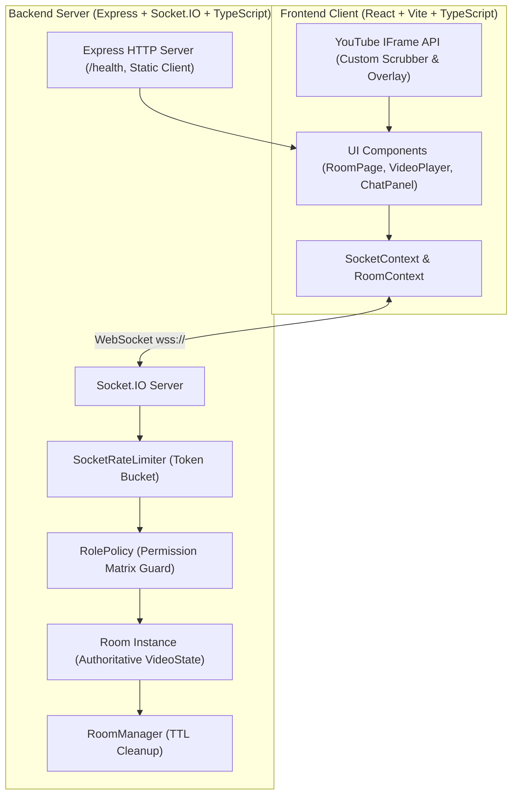

# 🎬 WatchParty — Real-Time Synchronized YouTube Watch Party

A production-grade, real-time synchronized YouTube watch party web application built with **React, TypeScript, Express, and Socket.IO**. Features **server-authoritative playback synchronization**, **multi-role access control (RBAC)**, an **interactive participant approval workflow**, **live in-room chat**, and **floating emoji reactions**.

---

## 🌐 Live Demo & Deployment

- **Live URL:** [https://watchparty.onrender.com](https://watchparty.onrender.com) *(Hosted on Render Web Service)*
- **Health Check Endpoint:** `https://watchparty.onrender.com/health`
> **Note on Render Free Tier:** The free web service spins down after 15 minutes of inactivity. If cold, initial request may take ~30–50 seconds to wake up.

---

## 📸 Screenshots & Showcase

| Room Overview & Live Chat | Role Management & Controls |
| :---: | :---: |
|  | Dark glassmorphic design, custom video scrubber, real-time chat with role badges, and quick emoji reactions. |

---

## ✨ Key Features

### 1. ⏱️ Authoritative Playback Synchronization
- **Server as Single Source of Truth:** Playback position is computed using anchor timestamps `(anchorPosition + (now - anchorTimestamp))`.
- **Drift Correction:** Client checks drift on periodic 5s heartbeats; corrects seek only when `|local - expected| > 1.5s`.
- **Echo Loop Prevention:** Emits are guarded by `isApplyingRemote` flag so programmatic updates never trigger outbound socket emits.
- **Autoplay Compliance:** Seamless click-to-join audio & stream gate satisfying strict modern browser audio autoplay policies.

### 2. 🛡️ Server-Enforced Role-Based Access Control (RBAC)
- **Roles:** `Host`, `Moderator`, `Participant`.
- **Cosmetic vs Server Security:** UI buttons are disabled for unauthorized participants, while the server validates permissions on every single incoming socket event.
- **Host Controls:** Promote to Moderator, Demote to Participant, Remove user (with persistent room blocklist), Transfer Host ownership.
- **Host Succession:** If the Host leaves or disconnects for > 30 seconds, host succession automatically promotes the earliest connected Moderator (or earliest connected Participant).

### 3. 🗳️ Participant Action Request & Approval Workflow
- Participants cannot change playback or video directly; they submit an **Action Request** (`play`, `pause`, `seek`, `change_video`).
- Max 3 pending requests per user with a 60-second TTL.
- Broadcast to Host and Moderators in real-time.
- Approving executes the action authoritatively and broadcasts `sync_state` to all room members; rejecting dismisses the request.

### 4. 💬 Live Chat & Floating Emoji Reactions (Bonus 9A)
- **In-Room Chat:** 300-character limit, token-bucket rate limiting (5 msgs / 5 sec), role badges (`HOST`, `MOD`), and smooth auto-scroll.
- **Floating Reactions:** Quick reaction bar (`👍`, `❤️`, `😂`, `😮`, `🔥`, `👏`) triggering floating reaction bursts across the video player.

---

## 🏛️ Architecture & System Design



### How WebSockets Fit the Synchronized Flow
1. **Clock Synchronization:** The server never expects clients to report their time as ground truth. Instead, when a privileged user triggers `play` at time `t`, the server records `{ playState: 'playing', anchorTime: t, anchorTimestamp: Date.now(), version: v + 1 }`.
2. **Periodic Heartbeat:** Every 5 seconds during playback, the server broadcasts `sync_state` to all room sockets.
3. **Idempotent Client Convergence:** Sockets receive `sync_state`, compute expected position `anchorTime + (now - anchorTimestamp)`, and only adjust local player time if drift exceeds 1.5 seconds.

---

## 🔒 Permission & Roles Matrix

| Action | Host | Moderator | Participant | Description |
| :--- | :---: | :---: | :---: | :--- |
| `play` | ✅ | ✅ | ❌ (Request only) | Play video at current or specified timestamp |
| `pause` | ✅ | ✅ | ❌ (Request only) | Pause video playback |
| `seek` | ✅ | ✅ | ❌ (Request only) | Jump video playback to specific timestamp |
| `change_video` | ✅ | ✅ | ❌ (Request only) | Switch YouTube URL or Video ID |
| `assign_role` | ✅ | ❌ | ❌ | Promote to Moderator or demote to Participant |
| `remove_participant`| ✅ | ❌ | ❌ | Kick participant and add to room blocklist |
| `transfer_host` | ✅ | ❌ | ❌ | Transfer Host role to another participant |
| `action_request` | ❌ | ❌ | ✅ | Propose playback change for Host/Mod approval |
| `resolve_request`| ✅ | ✅ | ❌ | Approve or reject pending participant request |
| `chat_message` | ✅ | ✅ | ✅ | Send message to room (max 300 chars, rate-limited)|
| `reaction` | ✅ | ✅ | ✅ | Send emoji reaction burst (allow-list only) |

---

## 📡 Socket.IO Event Reference

| Event Name | Direction | Payload Schema | Ack Response | Auth Guard |
| :--- | :--- | :--- | :--- | :--- |
| `create_room` | Client ➔ Server | `{ username: string, clientId: string }` | `{ ok: true, data: { roomId, userId, role } }` | Public |
| `join_room` | Client ➔ Server | `{ roomId: string, username: string, clientId: string }` | `{ ok: true, data: { roomId, userId, username, role } }` | Public / Blocklist |
| `leave_room` | Client ➔ Server | `{ roomId: string }` | `{ ok: true, data: { left: true } }` | Room Member |
| `room_state` | Server ➔ Client | `{ roomId, you, participants, videoState, pendingRequests }` | — | Emitted to joiner |
| `play` | Client ➔ Server | `{ time?: number }` | `{ ok: true, data: SyncStatePayload }` | Host, Mod |
| `pause` | Client ➔ Server | `{}` | `{ ok: true, data: SyncStatePayload }` | Host, Mod |
| `seek` | Client ➔ Server | `{ time: number }` | `{ ok: true, data: SyncStatePayload }` | Host, Mod |
| `change_video` | Client ➔ Server | `{ url?: string, videoId?: string }` | `{ ok: true, data: SyncStatePayload }` | Host, Mod |
| `sync_state` | Server ➔ Client | `{ videoId, playState, anchorTime, anchorTimestamp, version }`| — | Broadcast |
| `assign_role` | Client ➔ Server | `{ userId: string, role: "moderator" \| "participant" }` | `{ ok: true, data: { userId, role } }` | Host |
| `remove_participant`| Client ➔ Server| `{ userId: string }` | `{ ok: true, data: { removed: true } }` | Host |
| `transfer_host` | Client ➔ Server | `{ userId: string }` | `{ ok: true, data: { hostTransferred: true } }` | Host |
| `action_request`| Client ➔ Server | `{ type: string, payload: object }` | `{ ok: true, data: { requestId: string } }` | Participant |
| `resolve_request`| Client ➔ Server| `{ requestId: string, approve: boolean }` | `{ ok: true, data: { requestId, approved } }` | Host, Mod |
| `chat_message` | Client ➔ Server | `{ text: string }` | `{ ok: true, data: ChatMessage }` | Room Member |
| `reaction` | Client ➔ Server | `{ emoji: string }` | `{ ok: true, data: Reaction }` | Room Member |

---

## 🛠️ Local Development & Setup

### Prerequisites
- **Node.js**: v18.0.0 or higher (v20+ recommended)
- **npm**: v9.0.0 or higher

### 1. Clone the repository
```bash
git clone https://github.com/avani/watchparty.git
cd watchparty
```

### 2. Install dependencies
```bash
npm install
```

### 3. Environment Configuration
Create a `.env` file in `server/` (or copy from `.env.example`):
```bash
cp server/.env.example server/.env
```
Default `.env`:
```env
PORT=3000
NODE_ENV=development
CLIENT_ORIGIN=http://localhost:5173
```

### 4. Run Development Servers
```bash
# Start backend and frontend simultaneously
npm run dev:server    # Runs Express & Socket.IO server on port 3000
npm run dev:client    # Runs Vite dev server on port 5173
```
Open [http://localhost:5173](http://localhost:5173) in your browser.

### 5. Run Automated Tests
```bash
# Run 61 automated unit and integration tests across 12 test suites
npm test

# Run TypeScript typechecker / linter across monorepo
npm run lint
```

### 6. Build for Production
```bash
npm run build
```
This builds both the React client (`client/dist`) and compiles the TypeScript server (`server/dist`).

---

## 🚀 Deployment to Render

The repository includes a ready-to-deploy `render.yaml` specification:

```yaml
services:
  - type: web
    name: watchparty
    runtime: node
    plan: free
    buildCommand: npm install && npm run build
    startCommand: npm start
    healthCheckPath: /health
    envVars:
      - key: NODE_ENV
        value: production
      - key: PORT
        value: 10000
```

1. Push your code to GitHub.
2. Log into [Render Dashboard](https://dashboard.render.com).
3. Click **New +** ➔ **Blueprint** and select your repository (or create a **Web Service** with build command `npm install && npm run build` and start command `npm start`).
4. Set `trust proxy` in Express (already configured in `server/src/index.ts`).
5. Render will automatically build the client, compile the server, and serve the application with WebSocket upgrades enabled.

---

## 🎓 Technical Challenges & Engineering Solutions (Viva / Interview Prep)

### 1. Browser Autoplay Policies
- **Problem:** Browsers like Chrome and Safari block unmuted programmatic video playback unless preceded by a user gesture.
- **Solution:** Designed a transparent click-to-join gate overlay on the player. When clicked, it activates the user gesture, initializes audio, and syncs the player to the server's current timestamp.

### 2. Echo Loops & Ping-Pong State Cascades
- **Problem:** Programmatic calls to `player.seekTo()` or `player.playVideo()` trigger native player state change events, which could inadvertently emit socket events back to the server in an infinite loop.
- **Solution:** Protected client event handlers with an `isApplyingRemote` boolean ref flag. When remote state is being applied, local event listeners ignore the triggered state changes and reset the flag cleanly on next tick.

### 3. Native YouTube Player Seek Detection
- **Problem:** YouTube's IFrame API does not offer a dedicated `onSeek` event; users clicking the native scrubber cannot be reliably intercepted.
- **Solution:** YouTube player is embedded with `controls: 0` and `disablekb: 1`. A custom transparent overlay sits above the iframe, and playback is controlled exclusively through custom glassmorphic HTML/CSS scrubbers with server authority.

### 4. Host Disconnection & Succession Grace Period
- **Problem:** If a Host accidentally refreshes their page or loses Wi-Fi temporarily, immediately transferring host ownership would frustrate the host.
- **Solution:** When a Host disconnects, the server marks `connected = false` and starts a 30-second succession timer. If the Host reconnects with their persistent `clientId`, the timer is cancelled and their Host role is preserved. If 30 seconds elapse without reconnection, succession promotes the earliest connected Moderator (or earliest connected Participant).

### 5. Rate Limiting & Resource Leak Prevention
- **Problem:** Socket event spam or orphaned rooms and interval timers could exhaust Node.js event loop memory.
- **Solution:** Implemented a per-socket Token Bucket rate limiter (burst 20, 10 refills/sec; chat stricter at burst 5, 1 refill/sec). Every room has an explicit `destroy()` method that clears heartbeat intervals, host succession timers, and pending request collections upon room deletion.

---

## ⚖️ Trade-offs & Future Extensions

- **In-Memory vs Distributed State:** In-memory room storage was chosen for minimal latency and simplicity without external infrastructure dependencies. For multi-server scalability across horizontal instances, a Redis adapter (`@socket.io/redis-adapter`) and persistent room storage (MongoDB or PostgreSQL) can be seamlessly attached.
- **Authentication:** Currently relies on persistent browser `clientId` (UUID v4 stored in `localStorage`). A future enhancement could integrate OAuth 2.0 (Google/GitHub) or JWT authentication.

---

## 📄 License

MIT License. Built with ❤️ for seamless real-time shared streaming experiences.
