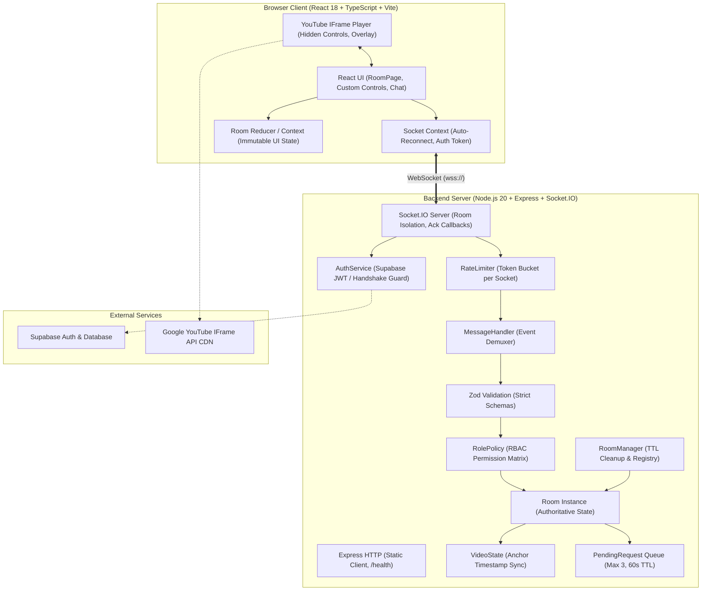
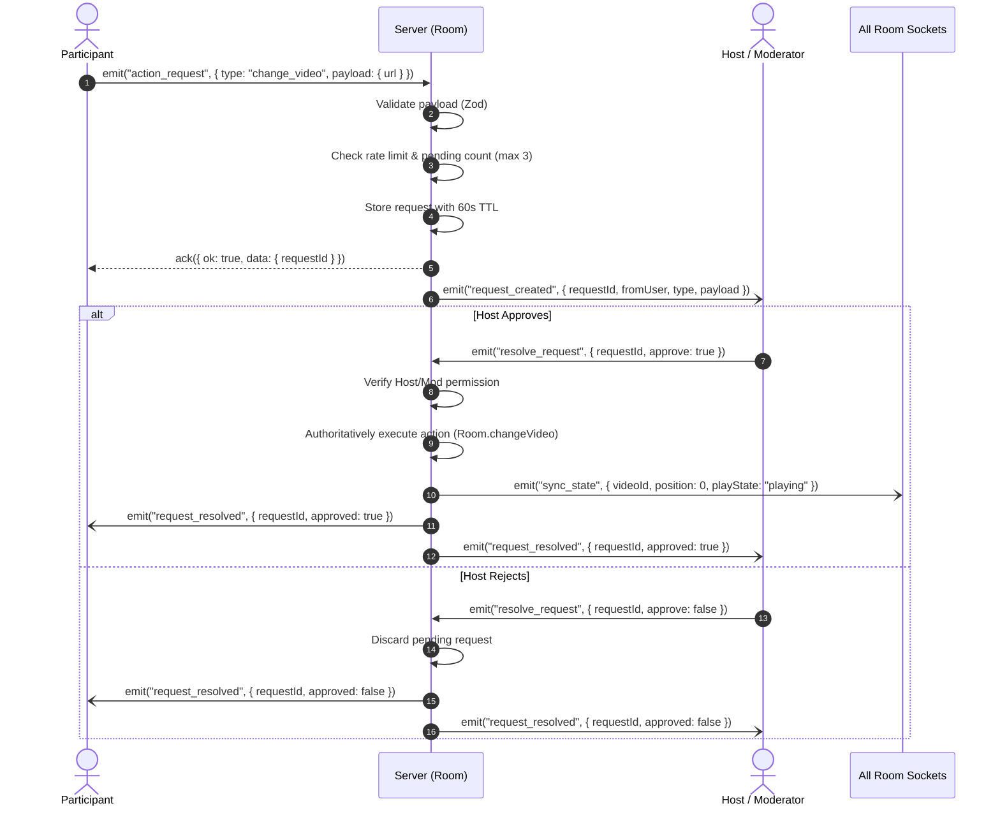

# Architecture & System Design — YouTube Watch Party

This document provides a comprehensive technical overview of the **YouTube Watch Party** system, detailing its architectural patterns, synchronization model, state management, security boundaries, and scalability considerations.

---

## 1. System Topology & Core Architecture

The system employs a **Server-Authoritative Hub-and-Spoke Topology**. Clients never interact peer-to-peer; every client intent is emitted to the central backend over an authenticated WebSocket (Socket.IO) connection. The server strictly validates permissions, mutates internal state, and broadcasts synchronized updates back to the room.

---

## 2. Real-Time Synchronization Model

Synchronizing media across disparate network latencies and browser rendering engines is the most demanding technical aspect of the system.

### Mathematical Anchor Model
Instead of continuously streaming current playback position, the server models video position using an **Anchor Timestamp Model**:

$$\text{effectivePosition} = 
\begin{cases} 
\text{position} + \frac{\text{currentTime} - \text{updatedAt}}{1000}, & \text{if } \text{playState} = \text{"playing"} \\
\text{position}, & \text{if } \text{playState} = \text{"paused"}
\end{cases}$$

Where:
- `position`: Floating-point second marker recorded at the anchor moment.
- `updatedAt`: Monotonic epoch millisecond timestamp recorded by the server when the state changed.
- `version`: Monotonically increasing sequence integer. Stale client updates with lower version numbers are discarded.

### Client Convergence & Drift Correction
To balance tight synchronization with visual smoothness, clients adhere to the following rules:
1. **Periodic Heartbeat:** While a room is playing, the server re-broadcasts `sync_state` every 5 seconds.
2. **Tolerance Deadband:** The client only invokes `player.seekTo()` if:
   $$|\text{localPlayerTime} - \text{expectedServerPosition}| > 1.5\text{ seconds}$$
   This deadband prevents micro-stutters and audio crackling caused by constant seek interruptions.
3. **Late-Join Synchronization:** When a client joins mid-stream, the initial `room_state` snapshot contains the calculated `effectivePosition`, cueing and seeking the player instantly to the active stream point.

### Echo-Loop Suppression
When a remote `sync_state` arrives at a client, calling `player.playVideo()` or `player.seekTo()` natively triggers YouTube's internal `onStateChange` listener. Without protection, this would cause the client to mistakenly believe the user initiated a change, firing an outbound socket event and causing an infinite feedback loop.
- **Solution:** All programmatic player updates set an internal `isApplyingRemote = true` flag. The local `onStateChange` handler verifies this flag and silently suppresses outbound event generation while it is active.

---

## 3. Role-Based Access Control (RBAC) & Security

The system enforces strict multi-role separation across three distinct roles:

| Role | Acquisition | Privileges |
| :--- | :--- | :--- |
| **Host** | Room Creator | Full playback control, participant promotion/demotion, participant removal, host transfer, request approval/rejection, in-room chat. |
| **Moderator** | Promoted by Host | Full playback control (`play`, `pause`, `seek`, `change_video`), request approval/rejection, in-room chat. Cannot alter roles or kick users. |
| **Participant** | Default for Joiners | Watch stream, propose playback changes via `action_request`, send text chat, fire emoji reactions. UI controls are cosmetically disabled. |

### Security Guarantees
1. **Zero Client Trust:** The backend derives actor identity exclusively from the active `socket.id -> Participant` mapping. Any `userId` supplied in event payloads is strictly treated as the *target*, never the actor.
2. **Strict Schema Validation:** Every incoming payload is validated against a strict Zod schema. Extra or unexpected fields are rejected with `INVALID_PAYLOAD`.
3. **Single Host Invariant:** Each room guarantees exactly one Host at any instant. A Host cannot be demoted or removed by other users.
4. **Token Bucket Rate Limiting:** Each connection has a token bucket protecting against DoS and socket spam (10 general events/s; chat limited to 1 msg/s with burst allowance of 5).

---

## 4. Participant Action Request & Approval Workflow

Per specification, Participants cannot directly mutate playback. Instead, an asynchronous approval workflow bridges participant interaction with host authority:

---

## 5. Resiliency & Edge Case Handling

1. **Page Refresh & Temporary Disconnect:** When a user's WebSocket drops, the server retains the `Participant` record with `connected = false` for a 30-second grace window. Reconnecting with the same persistent `clientId` restores their identity and role.
2. **Host Succession:** If the Host disconnects and fails to reconnect within 30 seconds (or explicitly emits `leave_room`), host succession automatically activates:
   - Priority 1: Earliest connected Moderator.
   - Priority 2: Earliest connected Participant.
   - The room is notified immediately via `host_transferred`.
3. **Resource Leak Prevention:** When all users leave a room, a 10-minute cleanup timer is initiated. If no user rejoins before the TTL expires, the room instance is destroyed, clearing all interval timers, succession timers, and pending request memory.

---

## 6. Supabase Authentication Integration

For authenticated sessions (Bonus 9C), the architecture integrates Supabase:
- **Client Side:** Users sign up / log in through the embedded `AuthModal`, which communicates directly with Supabase Auth to obtain a secure JSON Web Token (JWT).
- **Socket Handshake:** The access token is attached to the Socket.IO `auth: { token }` payload during connection initialization.
- **Server Verification:** `AuthService` verifies the JWT against Supabase's remote auth service, verifying the user's signature, extracting their immutable user ID (`user.id`), and assigning a verified identity to their room presence.
- **Graceful Fallback:** If Supabase credentials are not supplied, the application automatically operates in development mode with local demo profiles.

---

## 7. Scaling to 1,000+ Concurrent Users

To transition this single-node architecture into a horizontally scalable system:
1. **Redis Adapter (`@socket.io/redis-adapter`):** Distributes socket event broadcasts across a cluster of Node.js worker nodes via Redis Pub/Sub channels.
2. **External State Store (Postgres / Redis):** Move active room state, participant registries, and pending requests into Redis or Supabase PostgreSQL so any node can serve any room.
3. **Sticky Sessions / WebSocket Only:** Configure reverse proxies (e.g., NGINX, Cloudflare) with sticky session cookies or force direct WebSocket transport (`transports: ['websocket']`) to eliminate HTTP polling synchronization overhead.
